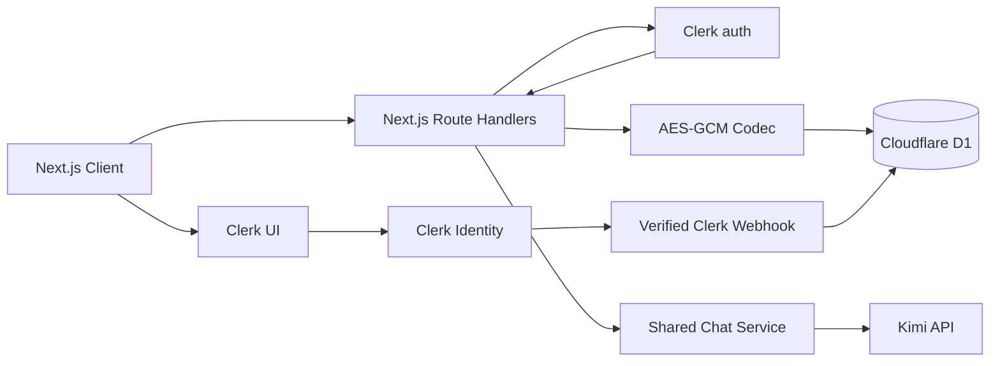

# Clerk 登录注册与 Cloudflare D1 对话持久化设计

> 状态：Proposed
> 最后更新：2026-08-29
> 适用项目：`echo-agents`
> 目标版本：首个支持账号与云端对话历史的版本

## 1. 直接结论

本项目应采用以下方案：

- 使用 Clerk 提供注册、登录、会话管理和账号管理；Next.js 服务端只信任 `auth()` 返回的 `userId`，不接受客户端传入的用户 ID。
- 使用 Cloudflare D1 保存用户的“是否允许保存历史”偏好、会话元数据和对话轮次。
- 保留当前无需登录的临时对话；只有登录用户主动开启“保存对话记录”后，才创建云端会话并持久化内容。
- Clerk 是身份数据的唯一事实来源。D1 不复制邮箱、姓名、头像等个人信息，只用 `clerk_user_id` 关联数据。
- 对话正文使用 AES-256-GCM 做应用层加密后再写入 D1。D1 自带的静态加密仍作为基础设施层保护。
- 已保存聊天使用服务端权威上下文：客户端只提交本轮用户输入和 `conversationId`，服务端从 D1 读取历史、验证所有权、构造模型上下文并保存最终审核后的回复。
- 将现有 `/api/chat` 拆成临时模式和保存模式两条显式分支，不允许保存失败时静默回退到临时模式。

这条路径比“登录后默认保存所有内容”多一个授权步骤，但它与项目现有“默认不留痕”承诺一致，也更适合当前涉及影像性暴力、危机披露和法律求助的敏感场景。

## 2. 背景与现状

### 2.1 当前技术状态

- Next.js 16 App Router、React 19、TypeScript。
- 通过 `@opennextjs/cloudflare` 部署到 Cloudflare Workers。
- `/api/chat` 接收客户端提交的完整消息数组，通过 SSE 返回 Kimi 流式结果。
- `components/companion-conversation-page.tsx` 和 `components/conversation-page.tsx` 只在 React 内存中维护消息。
- 结束对话时只把用户文本短暂放入 `sessionStorage`，用于匿名故事提交草稿。
- `app/privacy/page.tsx`、Landing 页和系统提示均承诺“默认不保存对话”。
- `wrangler.jsonc` 尚未声明 D1 binding，`next.config.ts` 尚未为 `next dev` 初始化 Cloudflare bindings。
- 当前速率限制和本地指标依赖进程内 `Map`/本地文件；它们在多实例 Workers 中不是全局一致的持久化能力，但不属于本设计的核心改造范围。

### 2.2 问题本质

“加入登录”和“保存对话”不是两个彼此独立的按钮：

1. Clerk 身份必须成为每次 D1 访问的授权边界。
2. 保存策略必须与现有隐私承诺一致。
3. SSE 回复只有在输出审核结束后才是最终内容，不能把未经审核的原始模型输出写入历史。
4. 用户删除数据后，D1 Time Travel 仍可能在有限保留期内包含旧快照；产品文案和恢复流程必须准确描述这一点。
5. 已保存会话不能继续相信客户端提交的整段历史，否则所有权校验虽然成立，历史内容仍可被篡改后送入模型。

## 3. 目标与非目标

### 3.1 目标

- 用户可使用 Clerk 完成注册、登录、退出和账号管理。
- 未登录用户仍可进行默认不保存的临时对话。
- 登录用户可显式开启或关闭未来对话的云端保存。
- 用户可查看、继续、归档、删除单个会话，以及删除全部对话数据。
- 所有 D1 查询都由服务端根据 Clerk `userId` 做所有权过滤。
- 流式生成、危机短路、输出替换、停止生成和失败重试在持久化后仍有确定语义。
- 本地、预览和生产环境使用独立数据库与独立 Clerk instance。
- 数据库变更通过版本化 migration 执行并可验证。

### 3.2 非目标

- 不在 D1 中建立 Clerk 用户资料镜像。
- 不实现组织、团队、角色权限或后台客服读取对话。
- 不实现对话正文全文搜索、向量检索或跨会话记忆。
- 不把匿名故事投稿迁移到本次对话表；故事投稿有独立授权与脱敏语义。
- 不在本轮重做全局限流或 usage metrics 存储。
- 不允许管理员通过普通产品接口读取用户对话。

## 4. 已选方案与备选方案

### 4.1 方案 A：登录可选，保存显式开启（选定）

临时聊天保持公开；登录只是获得跨设备历史的前置条件，登录后仍需单独同意保存。

优点：

- 保持当前低门槛求助体验。
- 与“默认不留痕”一致。
- 用户对身份暴露和内容留存拥有独立选择权。

代价：

- UI 和 API 需要同时维护临时、保存两种会话状态。
- 不能在用户登录后自动把之前的临时消息上传；如需上传，必须再次明确确认。

### 4.2 方案 B：聊天强制登录，登录后默认保存

实现更简单，但会改变当前产品的隐私边界，也可能让处于危机或担心身份暴露的用户无法匿名进入。不建议作为当前版本默认方案。

### 4.3 方案 C：匿名设备 ID + D1 保存

可在不登录时恢复历史，但匿名标识仍会形成可关联的数据轨迹，删除权、跨设备恢复和账号合并也更复杂。当前没有足够产品收益，不采用。

## 5. 总体架构



职责边界：

| 组件 | 负责 | 不负责 |
|---|---|---|
| Clerk | 注册、登录、session、账号状态 | 对话正文和保存偏好 |
| Next.js Route Handlers | 身份校验、授权、输入校验、业务编排 | 长期保存明文密钥 |
| D1 | 用户偏好、会话元数据、密文轮次 | Clerk PII、原始 API Key |
| Chat Service | 上下文构建、危机短路、模型调用、输出审核 | 用户身份来源 |
| Crypto Codec | 内容加解密、key version、AAD | 密钥生成和人工托管流程 |

## 6. 用户与隐私流程

### 6.1 注册和登录

1. 全局导航展示 Clerk 的登录、注册入口；登录后展示 `UserButton`。
2. 使用独立 `/sign-in`、`/sign-up` 页面承载 Clerk 预构建组件，便于直接链接和可访问性测试。
3. 登录成功后不自动开启历史保存。
4. `/conversations`、用户数据设置和所有保存型 API 必须登录。
5. `/support`、`/guests/[id]`、临时 `/api/chat` 继续公开。

### 6.2 首次开启保存

1. 登录用户在聊天页点击“开启云端保存”。
2. Dialog 明确说明保存内容、用途、删除方式、保留期和备份删除窗口。
3. 用户确认后，服务端写入 `history_enabled = 1`、`consent_version` 和 `consented_at`。
4. 只有确认完成后的新消息进入 D1。
5. 当前临时消息默认不上传；可提供“从下一条开始保存”。若未来要支持上传当前会话，必须单独确认且清楚展示上传范围。

### 6.3 关闭保存

- 关闭后只阻止未来创建和写入保存型会话。
- 已保存历史不会被暗中删除；设置页必须同时提供“删除全部历史”。
- 正在生成的保存型请求以请求开始时的授权状态为准，完成该轮后停止后续保存。
- 客户端状态和服务端偏好不一致时，以服务端为准。

### 6.4 删除

- 删除单个会话：同步从活动 D1 数据库硬删除，外键级联删除轮次。
- 删除全部历史：同步删除该用户全部会话，保存偏好保持不变；若用户选择“关闭并清空”，则在同一服务端操作中先关闭未来保存，再删除全部会话。
- 删除 Clerk 账号：`user.deleted` webhook 验签后删除 `app_users`，由外键级联清理会话。
- webhook 是最终清理机制，不应作为登录或首次写入的同步前置条件；Clerk 官方也明确 webhook 是最终一致且可能重试的。
- 活动数据库删除不等于备份立即物理消失。D1 Time Travel 在付费计划最多保留 30 天、免费计划最多 7 天。隐私说明应写明：删除后活动系统立即不可访问，备份中的副本在平台保留窗口结束后过期。

## 7. Clerk 集成设计

### 7.1 SDK 接入

实现阶段先运行 Clerk CLI 初始化，再 review 生成改动；当前项目使用 Bun：

```bash
bunx clerk@latest init
```

Next.js 16 原生推荐根目录 `proxy.ts`，但其 runtime 固定为 Node.js，而当前 `@opennextjs/cloudflare` 1.17 尚不支持 Node Middleware。现阶段使用仍受 Next.js 兼容的 `middleware.ts`，让 Clerk middleware 运行在 Edge runtime；待 OpenNext 支持 Node Middleware 后再迁回 `proxy.ts`。middleware 只负责启用 `clerkMiddleware()` 和匹配 Clerk/动态请求；具体授权放在每个服务端资源里，避免路径规则成为唯一安全边界。

`ClerkProvider` 放在 `app/layout.tsx` 的 `<body>` 内，并包住现有 `Providers`。项目已有 shadcn 组件体系，可按 Clerk 官方建议加入 `@clerk/ui` 的 shadcn theme，但视觉主题不应改变授权逻辑。

### 7.2 服务端授权规则

所有保存型 handler 使用以下顺序：

1. `await auth()` 获取 `userId`。
2. 未登录返回 `401`，不重定向 API 请求。
3. 从 path/query 读取资源 ID。
4. D1 查询始终带 `owner_id = ?`；先查再写不是充分保护，最终写语句本身也必须包含 owner 条件。
5. 不调用 `currentUser()` 获取邮箱或姓名，因为本设计不需要 Clerk Backend API 的用户资料。

### 7.3 Webhook

新增公开端点 `/api/webhooks/clerk`：

- 使用 Clerk `verifyWebhook()` 验证 Svix 签名。
- 只处理 `user.deleted`；事件重复投递必须幂等。
- 验签失败返回 `400`；数据库暂时失败返回 `5xx`，让 Clerk 重试。
- 不记录完整 webhook body、邮箱或用户资料。
- Clerk Dashboard 必须监控失败投递并支持 replay。

不需要订阅 `user.created`：首次开启保存时可使用 `INSERT ... ON CONFLICT DO UPDATE` 同步创建最小 `app_users` 行，避免首次使用依赖 webhook 的最终一致性。

## 8. D1 数据模型

### 8.1 设计原则

- D1 中只保存 Clerk subject、授权状态和业务数据，不复制身份 PII。
- 对话正文不可索引，以密文保存。
- 会话列表不展示正文摘要，默认标题仅由会话类型和时间生成，避免在元数据中泄露用户原话。
- 时间统一保存 Unix milliseconds，API 输出 ISO 8601。
- ID 使用服务端生成的 UUID；`client_message_id` 只作为幂等键。
- 通过外键和 `ON DELETE CASCADE` 保证删除闭包。

### 8.2 初始 schema

```sql
CREATE TABLE app_users (
  clerk_user_id TEXT PRIMARY KEY,
  history_enabled INTEGER NOT NULL DEFAULT 0
    CHECK (history_enabled IN (0, 1)),
  consent_version TEXT,
  consented_at INTEGER,
  created_at INTEGER NOT NULL,
  updated_at INTEGER NOT NULL
);

CREATE TABLE conversations (
  id TEXT PRIMARY KEY,
  owner_id TEXT NOT NULL,
  mode TEXT NOT NULL
    CHECK (mode IN ('companion', 'guest')),
  guest_id TEXT,
  status TEXT NOT NULL DEFAULT 'active'
    CHECK (status IN ('active', 'archived')),
  created_at INTEGER NOT NULL,
  updated_at INTEGER NOT NULL,
  last_message_at INTEGER,
  FOREIGN KEY (owner_id)
    REFERENCES app_users(clerk_user_id)
    ON DELETE CASCADE,
  CHECK (
    (mode = 'companion' AND guest_id IS NULL) OR
    (mode = 'guest' AND guest_id IS NOT NULL)
  )
);

CREATE TABLE conversation_turns (
  id TEXT PRIMARY KEY,
  conversation_id TEXT NOT NULL,
  client_message_id TEXT NOT NULL,
  user_ciphertext BLOB NOT NULL,
  user_iv BLOB NOT NULL,
  assistant_ciphertext BLOB,
  assistant_iv BLOB,
  encryption_key_version INTEGER NOT NULL,
  status TEXT NOT NULL
    CHECK (status IN ('pending', 'completed', 'stopped', 'failed')),
  error_code TEXT,
  created_at INTEGER NOT NULL,
  completed_at INTEGER,
  FOREIGN KEY (conversation_id)
    REFERENCES conversations(id)
    ON DELETE CASCADE,
  UNIQUE (conversation_id, client_message_id),
  CHECK (
    (status = 'completed' AND assistant_ciphertext IS NOT NULL AND assistant_iv IS NOT NULL) OR
    (status != 'completed' AND assistant_ciphertext IS NULL AND assistant_iv IS NULL)
  )
);

CREATE INDEX idx_conversations_owner_updated
  ON conversations(owner_id, updated_at DESC, id DESC);

CREATE INDEX idx_turns_conversation_created
  ON conversation_turns(conversation_id, created_at ASC, id ASC);
```

使用“一轮一行”而不是“一条消息一行”的理由：当前产品严格是一问一答，SSE 期间需要把用户输入与对应回复状态绑定在一起；`pending/completed/stopped/failed` 也更容易形成可恢复状态。若未来支持工具调用、多助手消息或分支编辑，再迁移到通用 message/event 模型。

### 8.3 索引与容量

- 会话列表命中 `(owner_id, updated_at, id)`。
- 会话详情命中 `(conversation_id, created_at, id)`。
- 幂等写由 `(conversation_id, client_message_id)` 唯一约束保证。
- 第一版禁止全文搜索，因此不为密文建立 FTS。
- D1 单库写入串行，查询应保持短小并避免扫描。当前一轮两次主要写入、按 owner/conversation 索引读取，适合初始规模。
- D1 单行上限为 2 MB；项目当前单消息上限远低于该值，但仍必须在加密前复用现有字符和请求体限制。

## 9. 内容加密

### 9.1 选型

D1 已自动提供 AES-256 静态加密和传输加密。考虑到本项目保存的是高度敏感对话，正文再使用 Workers Web Crypto 的 AES-256-GCM 做应用层加密，以降低数据库导出、只读运维访问或误查询直接暴露正文的风险。

### 9.2 密钥与密文格式

- 每段正文使用独立、随机的 96-bit IV。
- GCM authentication tag 保留在 Web Crypto 返回的 ciphertext 中。
- AAD 绑定 `conversationId`、`turnId`、role 和 key version，防止密文被跨行或跨角色替换。
- 数据行保存 `encryption_key_version`，不保存密钥 ID 之外的密钥信息。
- Worker secrets 使用 `CONVERSATION_ENCRYPTION_KEY_V1`；密钥为 32-byte random value 的 Base64 表示。
- 新版本写入新 key version，读取兼容旧 key；轮换完成前不能删除旧 secret。
- 日志、异常、测试 snapshot 均不得输出明文、密文或 IV。

密钥生成示例只应在受控终端执行，输出直接进入 secret 管理，不进入聊天、shell history 或仓库：

```bash
openssl rand -base64 32
```

### 9.3 搜索与恢复代价

应用层加密意味着不能直接在 D1 中搜索正文，也不能只靠 SQL 导出得到可读历史。这是有意的安全取舍。用户导出历史时必须走经过 Clerk 授权的应用 API；灾难恢复还要求同时保有对应 key version。

## 10. API 设计

所有响应错误采用稳定的英文 `code`，用户展示文案由客户端本地化。正文长度和消息数量继续复用 `lib/chat-context.ts` 的边界。

### 10.1 用户保存偏好

`GET /api/me/conversation-preferences`

```json
{
  "historyEnabled": false,
  "consentVersion": null,
  "consentedAt": null
}
```

`PUT /api/me/conversation-preferences`

```json
{
  "historyEnabled": true,
  "consentVersion": "conversation-storage-v1"
}
```

规则：

- 开启时 `consentVersion` 必填且必须等于服务端当前版本。
- 关闭时不删除旧历史。
- 未登录返回 `401 AUTH_REQUIRED`。

### 10.2 会话资源

| Method | Path | 说明 |
|---|---|---|
| `POST` | `/api/conversations` | 创建保存型会话 |
| `GET` | `/api/conversations?cursor=&limit=` | 游标分页会话列表 |
| `GET` | `/api/conversations/:id?cursor=&limit=` | 读取并解密会话轮次 |
| `PATCH` | `/api/conversations/:id` | 归档或恢复 |
| `DELETE` | `/api/conversations/:id` | 硬删除单个会话 |
| `DELETE` | `/api/me/conversations` | 硬删除当前用户全部会话 |

创建请求：

```json
{
  "mode": "companion",
  "guestId": null
}
```

服务端只在用户已登录且 `history_enabled = 1` 时创建，否则返回 `409 HISTORY_DISABLED`。`guestId` 必须存在于服务端 `GUESTS` 数据集中，不能只检查非空。

分页使用 opaque cursor，内部可编码 `(updated_at, id)` 或 `(created_at, id)`；禁止 offset pagination，避免新消息写入时出现重复或跳项。

### 10.3 聊天接口

临时模式保持现有协议，显式增加 discriminator：

```json
{
  "persistence": "ephemeral",
  "mode": "companion",
  "messages": [
    { "role": "user", "content": "..." }
  ]
}
```

保存模式不接受客户端历史：

```json
{
  "persistence": "saved",
  "conversationId": "...",
  "clientMessageId": "...",
  "content": "..."
}
```

保存模式处理顺序：

1. 校验 Clerk session、保存偏好、会话 owner 和输入边界。
2. 加密用户输入；通过 owner-scoped statement 插入 `pending` turn，并用 D1 batch 原子更新会话时间；唯一约束实现幂等。
3. 从 D1 加载该会话首轮用户输入和最近轮次，解密后交给现有 `buildChatContext()` 再裁剪。
4. 运行危机检测、prompt injection 检测和意图路由。
5. 危机命中时不调用模型，直接把固定安全回复作为最终 assistant 内容保存。
6. 普通请求调用 Kimi 并流式返回；原始 delta 只存在于请求内存中，不写 D1。
7. 完成 guest boundary/output moderation 后，只加密并保存最终可见内容。
8. D1 更新成功后发送 `[DONE]`。若最终保存失败，发送结构化 `persistence_error` 事件并明确提示该回复未进入历史，不能伪装成功。

建议新增 SSE 事件：

```json
{
  "type": "persistence_error",
  "code": "FINAL_WRITE_FAILED",
  "retryable": true
}
```

### 10.4 幂等与异常状态

- 相同 `clientMessageId` 已 `completed`：不再次调用 Kimi，直接把已保存回复作为一次完整 SSE 响应重放。
- 相同 ID 仍 `pending` 且未超时：返回 `409 TURN_IN_PROGRESS`。
- 生成失败：turn 标记 `failed`，只保存 allowlisted `error_code`，不保存异常堆栈。
- 用户停止生成：不保存未经最终审核的 partial output，turn 标记 `stopped`；历史页显示“生成已停止”。
- 手动重试创建新的 `clientMessageId`，保留上一轮失败状态，避免一个 ID 表示多个模型调用。
- `pending` 超过服务端超时上限后可在读取时惰性修正为 `failed`；不要引入常驻后台进程假设。

## 11. 代码模块边界

建议按以下边界实施，避免把数据库、Clerk 和 Kimi 编排继续堆入当前 route 文件：

| 文件/目录 | 变更目的 |
|---|---|
| `app/layout.tsx` | 接入 `ClerkProvider` |
| `middleware.ts` | 临时以 Edge runtime 启用 `clerkMiddleware()`；OpenNext 支持 Node Middleware 后迁回 `proxy.ts` |
| `app/sign-in/[[...sign-in]]/page.tsx` | 登录页面 |
| `app/sign-up/[[...sign-up]]/page.tsx` | 注册页面 |
| `app/conversations/page.tsx` | 受保护的历史列表 |
| `app/api/me/conversation-preferences/route.ts` | 保存授权读写 |
| `app/api/conversations/**/route.ts` | 会话 CRUD |
| `app/api/webhooks/clerk/route.ts` | 账号删除 webhook |
| `app/api/chat/route.ts` | 协议分流、SSE response |
| `lib/auth/require-user.ts` | 统一 `401` 语义和 `userId` 提取 |
| `lib/db/d1.ts` | 获取并类型化 D1 binding |
| `lib/db/conversation-repository.ts` | 所有 owner-scoped SQL |
| `lib/crypto/conversation-codec.ts` | AES-GCM 加解密和 key version |
| `lib/chat-service.ts` | 复用当前危机、上下文、Kimi、审核流程 |
| `migrations/*.sql` | D1 schema 版本 |
| `scripts/conversation-persistence.test.ts` | repository/API 回归 |
| `docs/safety-test-cases.md` | 增补登录、保存、删除和隐私用例 |

`lib/chat-service.ts` 必须同时服务临时与保存模式，不能复制两套安全护栏。route 负责 I/O 和授权，service 负责聊天决策，repository 负责存储；三者不可反向依赖 React 组件。

## 12. Cloudflare 配置与环境

### 12.1 D1 binding

`wrangler.jsonc` 增加独立的 D1 binding，名称统一为 `DB`：

```jsonc
{
  "d1_databases": [
    {
      "binding": "DB",
      "database_name": "echo-agents-db",
      "database_id": "<DATABASE_ID>",
      "migrations_dir": "migrations"
    }
  ]
}
```

数据库位置必须在创建时决定，后续不能修改 jurisdiction。目标用户主要位于中国大陆时，可先评估 `apac` location hint；若存在明确 GDPR 数据驻留要求，则创建时选择 `eu` jurisdiction。该决定触及合规与数据迁移成本，上线前必须由苏雄确认。

### 12.2 本地 binding

`next.config.ts` 调用 OpenNext 的开发初始化函数，使 `bun run dev` 可访问本地模拟 binding：

```ts
import { initOpenNextCloudflareForDev } from "@opennextjs/cloudflare"

initOpenNextCloudflareForDev()
```

业务代码通过 `getCloudflareContext().env.DB` 访问 D1，并在修改 binding 后运行 type generation。

### 12.3 配置矩阵

| 名称 | 类型 | 用途 |
|---|---|---|
| `NEXT_PUBLIC_CLERK_PUBLISHABLE_KEY` | public config | Clerk frontend |
| `CLERK_SECRET_KEY` | Worker secret | Clerk server SDK |
| `CLERK_WEBHOOK_SIGNING_SECRET` | Worker secret | Webhook verification |
| `CONVERSATION_ENCRYPTION_KEY_V1` | Worker secret | Conversation content encryption |
| `KIMI_API_KEY` | Worker secret | Existing Kimi integration |
| `DB` | D1 binding | Application database |

`wrangler.jsonc` 的 `secrets.required` 应声明上述 secret 名称但绝不保存值。开发、预览、生产使用不同 Clerk instance、D1 database 和 encryption key。生产数据禁止连接到本地 `next dev` 的默认配置。

## 13. Migration 与部署流程

初始命令建议：

```bash
bunx wrangler d1 create echo-agents-db --location=apac
bunx wrangler d1 migrations create echo-agents-db init-conversation-storage
bunx wrangler d1 migrations apply echo-agents-db --local
bun run cf-typegen
bun run build:cloudflare
```

生产 migration 是显式高风险步骤：

```bash
bunx wrangler d1 migrations list echo-agents-db --remote
bunx wrangler d1 migrations apply echo-agents-db --remote
```

执行远端 migration 前必须：

1. review migration SQL 和 `git diff`；
2. 确认目标 database name/id；
3. 记录当前 D1 Time Travel bookmark；
4. 在 staging 跑完 schema、CRUD、删除级联和 OpenNext build；
5. 只做向前兼容 schema 变更，应用稳定后再清理旧列。

禁止让应用启动时自动执行 migration。

## 14. 安全与隐私控制

### 14.1 必须满足

- 所有资源读写均校验 Clerk session 和 owner，不使用客户端 `userId`。
- 所有 SQL 使用 prepared statement 和 bind 参数。
- 正文在进入日志前即视为敏感数据；日志只记录 request ID、错误码、耗时和布尔安全指标。
- 只持久化最终审核后的 assistant 内容，不保存 raw model output。
- 不持久化浏览器提交的 Kimi key，也不把它写入任何对话 metadata。
- 删除操作使用明确的 resource ID 和 owner 条件；不提供任意 SQL 或批量管理员接口。
- 导出/读取接口设置 `Cache-Control: private, no-store`。
- Clerk 页面和脚本加入 CSP 时以 Clerk 官方 CSP 指南为准，不放宽为无约束通配符。
- `UserButton` 的账号删除与本地数据清理需做端到端验收。

### 14.2 威胁与控制

| 威胁 | 控制 |
|---|---|
| IDOR 读取他人会话 | 每条 SQL 带 `owner_id`，repository ownership tests |
| 客户端伪造历史 | 保存模式只接受本轮 content，历史由 D1 加载 |
| 重试导致重复扣费/重复消息 | `client_message_id` 唯一约束和 completed replay |
| 数据库导出暴露正文 | AES-GCM 应用层加密，key 在 Worker secret |
| 密文跨行替换 | AAD 绑定 conversation/turn/role/version |
| 日志泄露危机或身份内容 | safe structured logs，不记录 body/content |
| webhook 伪造删除 | `verifyWebhook()` 验签，幂等删除 |
| 删除后备份恢复导致数据回归 | 恢复 SOP 必须重放删除清单并抽样验证 |
| 保存故障被误认为成功 | 明确 `persistence_error`，禁止 silent fallback |

### 14.3 恢复与删除清单

D1 Time Travel restore 会覆盖当前数据库。生产恢复前必须导出恢复点之后的删除事件清单，恢复后重新执行删除并验证 owner 行数为零。MVP 可将仅含 pseudonymous owner reference 和删除时间的审计事件发送到独立、无正文的安全日志；不能只把删除清单放在同一个会被回滚的数据库中。

## 15. 保留策略与待确认决策

建议初始策略：

- 默认保存 180 天，以 `last_message_at` 计算；到期前在历史列表提示。
- 用户可随时删除单个或全部历史。
- 第一版若尚未实现可靠的定时清理，则不得在隐私文案中承诺“180 天自动删除”；应先写“由用户主动删除”，待清理任务上线后再更新承诺。
- 删除后活动数据立即不可访问；D1 Time Travel 副本按当前套餐最多 7/30 天过期。

上线前需要苏雄明确确认：

1. 数据 location/jurisdiction：`apac` 还是 `eu`。
2. 是否接受建议的 180 天保留期，或改为用户手动删除前长期保留。
3. 是否允许保存嘉宾模式对话，还是第一版只保存 companion 模式。
4. 账号删除后本地数据清理 SLA，建议为 webhook 成功后立即、最迟 24 小时内通过告警和 replay 完成。

这些决策会改变用户承诺或迁移成本，不能在实现时由工程默认值替代。

## 16. 分阶段实施

### Phase 1：身份接入

- Clerk SDK、`ClerkProvider`、兼容 OpenNext 的 `middleware.ts`。
- 登录/注册页和全局账号入口。
- 服务端 auth helper 与受保护空历史页。
- 不改聊天存储行为，确保现有隐私语义不回归。

停止条件：Clerk 在 OpenNext preview 无法稳定建立/刷新 session，或需要放宽现有安全 header 才能工作时，停止并重新评估部署兼容性。

### Phase 2：D1 与偏好

- 创建 staging D1、migration、binding 和类型。
- repository、加密 codec、保存授权 API。
- 单会话 CRUD、全部删除和 Clerk delete webhook。
- 先用假对话数据验证，不接 Kimi。

停止条件：migration、级联删除或加密 round-trip 任一失败两次且原因相同，停止自动重试并记录最小复现。

### Phase 3：保存型 SSE

- 抽取共享 chat service。
- 增加 `ephemeral/saved` discriminator。
- 服务端权威上下文、幂等 turn 和最终回复保存。
- 前端历史列表、恢复会话、保存故障状态。

停止条件：出现 raw model output 入库、跨用户读取、保存失败误报成功任一情况，立即阻止发布。

### Phase 4：隐私闭环

- 更新 Landing、聊天页和 `app/privacy/page.tsx`。
- 增加数据导出/删除说明、备份窗口、保留期。
- 建立 webhook 失败告警和恢复后删除重放 SOP。
- 完成人工隐私与安全 review 后再开放生产保存。

## 17. 结构化验证计划

### 17.1 自动化命令

```bash
bun run lint
bun run test:safety
bun run test:legal-golden
bunx wrangler d1 migrations apply echo-agents-db --local
bun run cf-typegen
bun run build
bun run build:cloudflare
```

API E2E 仍按现有约定先启动开发服务：

```bash
bun run dev
bun run test:safety:e2e
```

### 17.2 新增测试覆盖

| 类别 | 用例 | 预期 |
|---|---|---|
| Auth | 未登录访问历史 API | `401 AUTH_REQUIRED` |
| Ownership | User A 读写/删 User B 会话 | 404 或 403，且数据库不变 |
| Consent | 登录但未开启保存 | `409 HISTORY_DISABLED` |
| Encryption | round-trip、错误 key、篡改 IV/AAD/ciphertext | 正常解密或稳定失败，不输出明文 |
| Idempotency | 同一 client ID 重复提交 | 只调用一次模型，完成后重放 |
| SSE | 最终审核替换 | 只保存 replacement，不保存 raw output |
| Crisis | 保存模式危机输入 | 不调用 Kimi，固定回复被加密保存 |
| Abort | 中途停止 | partial output 不入库，turn 为 `stopped` |
| Failure | final D1 write 失败 | UI 显示未保存，不能收到成功状态 |
| Delete | 单会话、全部历史、Clerk delete webhook | 活动表无孤儿行，重复 webhook 仍成功 |
| Pagination | 并发新增后翻页 | 无重复、无跳项 |
| Logging | 故障与 webhook | 日志不含正文、邮箱、token、ciphertext |

### 17.3 人工验收

- 未登录进入 `/support`，确认仍能临时聊天且文案为“不保存”。
- 登录后未授权，确认没有任何 conversation/turn 行。
- 开启保存，从下一条消息开始形成历史；换设备登录后可恢复。
- 关闭保存后继续聊天，确认旧历史保留、新内容不入库。
- 删除历史后刷新、换设备、直接访问旧 URL 均不可读取。
- Clerk Dashboard 删除账号，确认 webhook 成功且 D1 级联清理。
- 在 Cloudflare preview 完成注册、session refresh、SSE、D1 读写全链路。

### 17.4 性能反馈指标

不记录内容，只记录聚合指标：

- `chat_first_byte_ms`
- `conversation_read_ms`
- `conversation_write_ms`
- `conversation_rows_read`
- `persistence_error_count`
- `encryption_error_count`
- `webhook_failure_count`
- `stale_pending_turn_count`

初始验收目标：保存模式相对临时模式的首字节额外延迟 P95 小于 250 ms；D1 owner-scoped 查询必须命中预期索引，可用 `EXPLAIN QUERY PLAN` 抽检。

## 18. 发布验收与停止条件

满足以下全部条件才可开启生产保存：

- Clerk 注册、登录、退出、session refresh 在 Cloudflare preview 通过。
- 本地和 staging migration 退出码为 0，schema 与预期一致。
- 单元、API E2E、现有安全回归、OpenNext build 全部通过。
- maker/checker review 未发现 IDOR、明文入库、日志泄露或密钥进入客户端 bundle。
- 隐私页、Landing 和聊天页不再出现互相矛盾的保存承诺。
- 用户能关闭未来保存、删除单个会话、删除全部历史。
- webhook 验签、重试和重复投递已验证。
- 数据 location、保留期、嘉宾模式范围已经由苏雄确认并写回本文件。

任何一项不满足都视为未完成，不以“主要流程可用”替代验收。

## 19. 实施后的沉淀

完成实现后应留下以下可复用状态，而不只留下代码：

- `migrations/` 中可 review、可重放的 schema 历史。
- repository ownership tests，防止未来新增 API 漏掉 owner 条件。
- encryption test vectors 和 key rotation runbook。
- Clerk webhook replay 与 D1 restore 后删除重放 SOP。
- `docs/safety-test-cases.md` 中固定的认证/保存/删除用例。
- 在项目 `AGENTS.md` 中固化规则：任何对话正文不得进入日志，任何会话 SQL 必须 owner-scoped。

## 20. 官方参考

- [Clerk Next.js App Router quickstart](https://clerk.com/docs/nextjs/getting-started/quickstart)
- [Clerk Next.js Route Handlers](https://clerk.com/docs/reference/nextjs/app-router/route-handlers)
- [Clerk middleware reference](https://clerk.com/docs/reference/nextjs/clerk-middleware)
- [Clerk webhook data sync guidance](https://clerk.com/docs/guides/development/webhooks/syncing)
- [Cloudflare D1 bindings with OpenNext](https://opennext.js.org/cloudflare/bindings)
- [Cloudflare D1 migrations](https://developers.cloudflare.com/d1/reference/migrations/)
- [Cloudflare D1 prepared statements](https://developers.cloudflare.com/d1/worker-api/prepared-statements/)
- [Cloudflare D1 foreign keys](https://developers.cloudflare.com/d1/sql-api/foreign-keys/)
- [Cloudflare D1 data security](https://developers.cloudflare.com/d1/reference/data-security/)
- [Cloudflare D1 data location](https://developers.cloudflare.com/d1/configuration/data-location/)
- [Cloudflare D1 limits](https://developers.cloudflare.com/d1/platform/limits/)
- [Cloudflare D1 Time Travel](https://developers.cloudflare.com/d1/reference/time-travel/)
- [Cloudflare Workers Web Crypto](https://developers.cloudflare.com/workers/runtime-apis/web-crypto/)
- [Cloudflare Workers secrets](https://developers.cloudflare.com/workers/configuration/secrets/)
