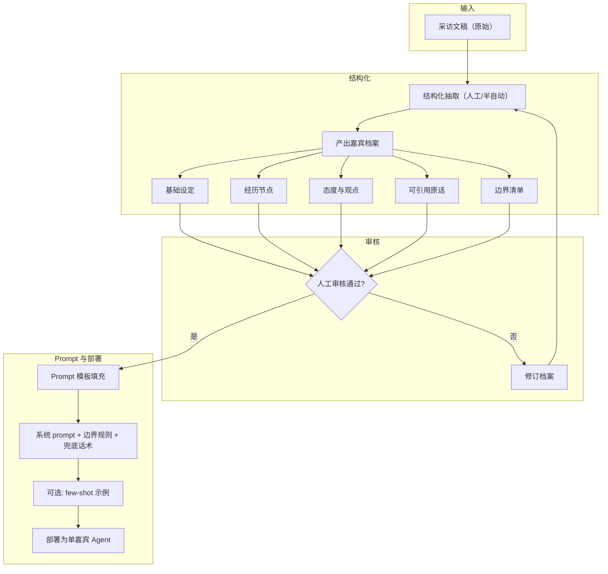
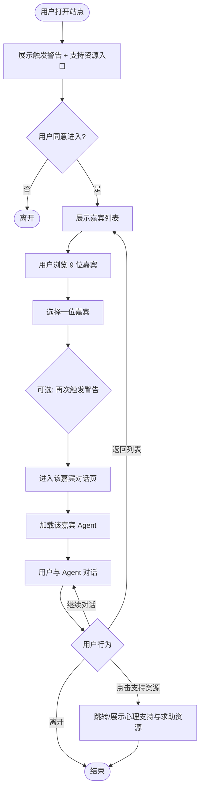
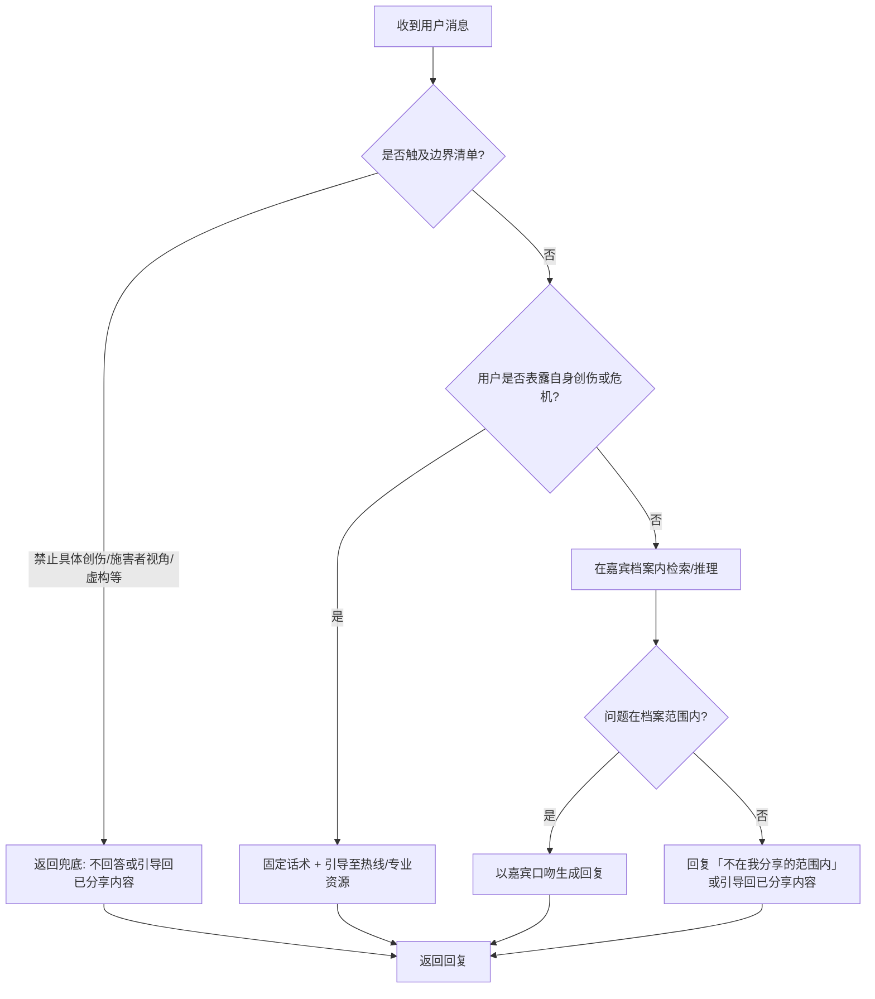
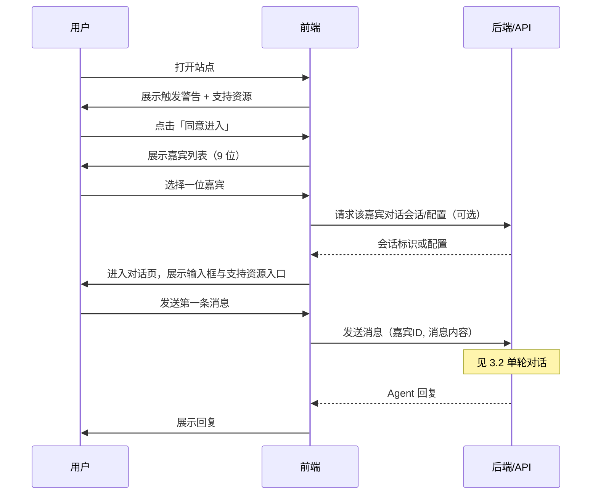
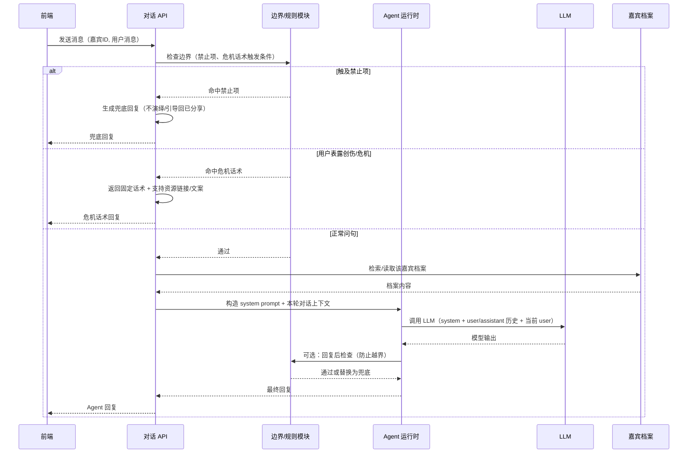
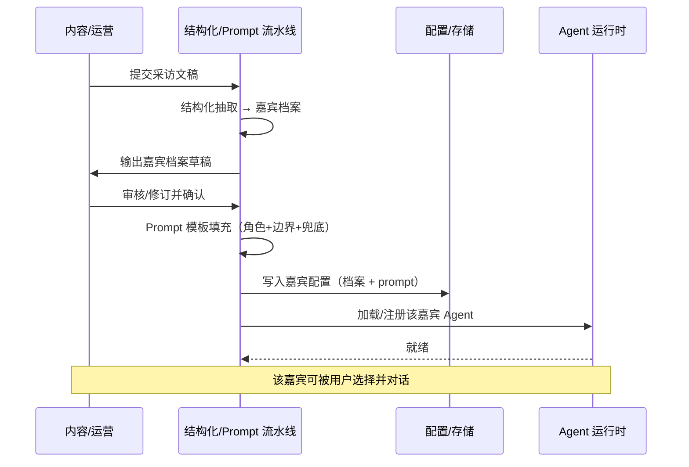

# 性暴力幸存者故事 Agent —— 核心业务流程（活动图 + 时序图）

基于 [性暴力幸存者故事 Agent MVP 产品设计](./sexual-violence-survivor-agent-mvp.md) 梳理的核心流程与交互。

---

## 1. 核心业务概览

两条主流程：

- **内容生产流程**：采访稿 → 嘉宾档案 → Prompt → 部署 Agent（运营侧，离线/后台）。
- **用户使用流程**：进入站点 → 触发警告与同意 → 选嘉宾 → 对话了解故事（用户侧，在线）。

---

## 2. 活动图

### 2.1 内容生产流程（采访稿 → 单嘉宾 Agent）

运营/内容侧：从原始采访到可用的「单嘉宾 Agent」的流水线。

**说明**：嘉宾档案含五类内容；审核不通过则回到结构化修订；通过后进入 Prompt 填充并部署。

---

### 2.2 用户使用流程（从进入站点到对话）

用户侧：从打开产品到与某位嘉宾 Agent 对话的完整路径。

**说明**：同意后进入列表；选嘉宾后进入对话；对话中可随时访问支持资源、返回列表或离开。

---

### 2.3 单轮对话内 Agent 行为（边界与兜底）

单轮「用户发问 → Agent 回复」的内部逻辑分支。

**说明**：先做边界与危机判断，再决定是档案内回答还是统一兜底/引导。

---

## 3. 时序图

### 3.1 用户从进入站点到开始对话

用户、前端、后端（若有）之间的主要交互顺序。

**说明**：MVP 下会话可为无状态或仅会话内上下文；若需「会话 ID」则由后端在首次对话时分配。

---

### 3.2 单轮对话（用户消息 → Agent 回复）

后端内部：前端请求抵达后，Agent 运行时与 LLM 的协作及边界检查。

**说明**：先做边界与危机判断；仅「正常问句」走档案 + LLM；可选对 LLM 输出做一次越界检查再返回。

---

### 3.3 内容生产侧：从档案到部署（协作时序）

表达内容、Prompt、部署角色之间的协作顺序（可与 2.1 活动图对照）。

**说明**：人工审核是关键节点；配置落库后由运行时加载，无需每次请求时再读档案原文。

---

## 4. 图与 MVP 文档的对应关系

| 图 | 对应文档章节 | 用途 |
|----|--------------|------|
| 2.1 内容生产活动图 | §4.1 采访→Agent 流水线、§6.1 角色划分 | 运营侧从稿子到上线一嘉宾的步骤与分支 |
| 2.2 用户使用活动图 | §3 信息架构、§4.3 用户侧流程 | 用户从进入、同意、选人到对话的路径 |
| 2.3 单轮对话活动图 | §4.2 对话边界规则 | 单轮回复的边界/危机/档案内逻辑 |
| 3.1 用户到时序图 | §3 IA、§4.3 | 用户与前端、API 的请求顺序 |
| 3.2 单轮对话时序图 | §4.2、§6.1 Agent 运行时 | 后端内部边界→档案→LLM→回复的协作 |
| 3.3 内容生产时序图 | §4.1、§7 里程碑 | 内容侧人机协作与部署衔接 |

---

*文档版本：v1 | 基于 MVP 产品设计文档梳理*
