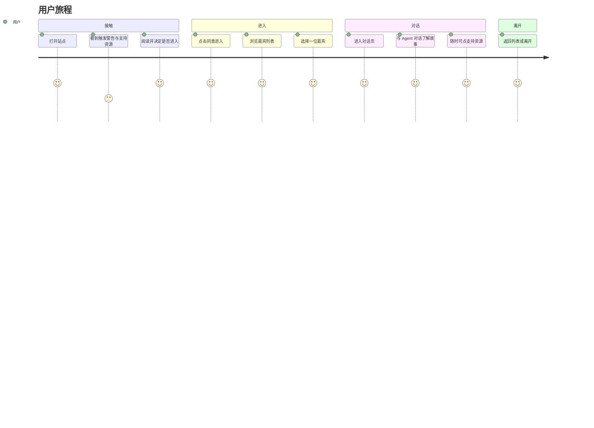

# 性暴力幸存者故事 Agent —— 用户旅程图

基于 [MVP 产品设计](./sexual-violence-survivor-agent-mvp.md) 的公众侧用户旅程：从认知、进入、选择嘉宾到对话了解故事，以及支持资源的可达性。

---

## 1. 用户角色（Persona）

| 维度 | 描述 |
|------|------|
| **角色** | 公众用户——希望了解性暴力幸存者经历、促进共情与反思的人 |
| **目标** | 通过对话安全、可控地了解嘉宾的故事与态度，不消费创伤 |
| **可能状态** | 好奇 / 关心议题 / 曾受类似创伤（需支持资源可见） |

---

## 2. 旅程阶段总览



---

## 3. 分阶段旅程详表

### 阶段一：接触与知情

| 维度 | 内容 |
|------|------|
| **阶段** | 接触与知情 |
| **用户行为** | 打开站点 / 看到首屏 / 阅读触发警告与支持资源说明 / 决定「进入」或「离开」 |
| **用户目标** | 知道这个产品是做什么的、内容可能带来什么影响、哪里有求助渠道 |
| **想法/心声** | 「内容会涉及什么？」「如果我感到不适怎么办？」「我可以随时退出吗？」 |
| **触点** | 首页；触发警告文案；支持资源入口（热线、机构）；「同意进入」与「离开」按钮 |
| **情绪** | 好奇中带一点谨慎；若曾受创伤可能紧张，需要清晰说明与出口 |
| **痛点** | 警告过长易跳过；资源不醒目会降低安全感 |
| **机会点** | 文案简洁、尊重选择；支持资源常驻、易发现；同意即表示知情，减少事后纠纷 |

---

### 阶段二：选择嘉宾

| 维度 | 内容 |
|------|------|
| **阶段** | 选择嘉宾 |
| **用户行为** | 浏览 9 位嘉宾卡片（化名/匿名、一句话介绍、可选头像/剪影）/ 选择一位 / 可选再看到一次简短触发提示后进入对话 |
| **用户目标** | 找到自己想了解的那位嘉宾，或凭直觉选一位开始 |
| **想法/心声** | 「哪位更想先了解？」「介绍是否足够让我做选择？」 |
| **触点** | 嘉宾列表页；嘉宾卡片；可选「再次触发警告」弹窗/文案；「进入对话」按钮 |
| **情绪** | 从谨慎转为轻度期待；选择时有掌控感 |
| **痛点** | 介绍过于模糊难以选择；列表信息量过大易疲劳 |
| **机会点** | 一句话介绍突出「态度/主题」而非创伤细节；保持 9 位数量可控；再次警告可跳过但存在 |

---

### 阶段三：对话了解故事

| 维度 | 内容 |
|------|------|
| **阶段** | 对话了解故事 |
| **用户行为** | 在对话页输入问题 / 阅读 Agent 以嘉宾口吻的回复 / 追问或换话题 / 随时点击「支持资源」或返回列表 |
| **用户目标** | 通过问答了解该嘉宾的经历节点、态度与观点，形成共情与理解 |
| **想法/心声** | 「我想问……」「这个回答是否来自 ta 真实分享？」「有点难受时知道可以点支持资源」 |
| **触点** | 对话页；输入框；Agent 回复气泡；常驻的「支持资源」入口；返回列表/离开 |
| **情绪** | 投入对话时可能共鸣或触动；若被边界/兜底回复打断会有「问不到」的轻微落差，但理解是安全设计 |
| **痛点** | 问题超出档案时只能得到「不在分享范围内」；若用户自身有创伤，需快速看到支持资源 |
| **机会点** | 回复始终在边界内，建立信任；支持资源常驻、一键可达；兜底话术温和并引导回已分享内容 |

---

### 阶段四：离开或继续

| 维度 | 内容 |
|------|------|
| **阶段** | 离开或继续 |
| **用户行为** | 返回嘉宾列表换人 / 直接关闭或离开 / 需要时通过支持资源寻求帮助 |
| **用户目标** | 自然结束或切换；若被触动可立即找到求助渠道 |
| **想法/心声** | 「先看到这里」「想换一位听听」「有点难受，去看看热线」 |
| **触点** | 返回列表；关闭页签；支持资源页/外链 |
| **情绪** | 平静离开或带着一点反思；若需帮助则希望入口明确、无 stigma |
| **痛点** | 离开路径不清晰会让人「卡」在对话里 |
| **机会点** | 返回与离开入口明显；支持资源在列表页和对话页都可触达 |

---

## 4. 情绪曲线（示意）

```
情绪
  ^
  |      ___ 选择嘉宾 __  对话中（共鸣/可控）
  |     /                    \___
  |    / 同意进入（掌控感）       \  离开（平静/反思）
  |   /
  |  / 接触（谨慎/好奇）
  | /
  +---------------------------------> 时间
     接触    选择    对话    离开
```

- **接触**：谨慎、好奇，知情后做选择会带来掌控感。
- **选择**：列表清晰则期待感上升。
- **对话**：在边界内了解故事，可能共鸣或触动；支持资源常驻维持安全感。
- **离开**：可随时退出或求助，避免「被困住」的负面情绪。

---

## 5. 与 MVP 文档的对应

| 旅程阶段 | 对应 MVP 章节 | 设计要点 |
|----------|----------------|----------|
| 接触与知情 | §3 IA、§4.3、§5.3 | 触发警告 + 支持资源 + 同意进入 |
| 选择嘉宾 | §2.1 嘉宾列表与选择、§3 | 9 位、化名/一句话、可选再次警告 |
| 对话了解故事 | §2.1 对话式了解、§4.2 边界规则、§5.3 | 档案内回答、兜底话术、会话内支持资源 |
| 离开或继续 | §4.3、§3 | 返回列表、支持资源常驻 |

---

*文档版本：v1 | 基于 MVP 产品设计*
