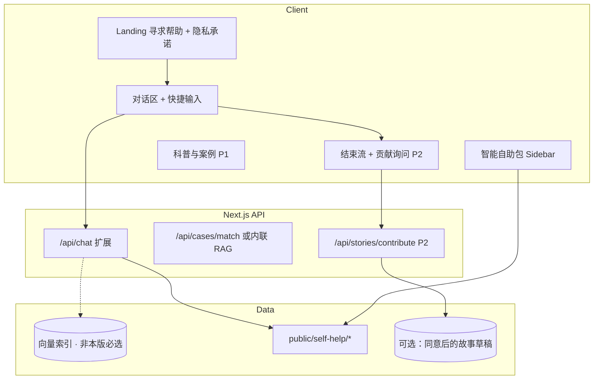

# 实现计划：AI 影像性暴力支持平台「小影」

本文档说明如何在当前 **echo-agents** 代码库（Next.js App Router + Kimi 流式对话）上落地你给出的产品愿景，按 **P0 → P1 → P2** 分阶段实施，并附关键 **代码片段**（标识为示意，路径与现有项目一致时可逐段替换/新增）。

---

## 1. 与现状的差异（起点）

| 现状                               | 目标                                                                |
| ---------------------------------- | ------------------------------------------------------------------- |
| 「嘉宾」叙事 + 化名列表            | **单一 AI 同伴**（平稳、坚定、高共情），语境为 AI 影像性暴力支持    |
| System prompt 侧重「授权采访边界」 | 侧重 **非责怪、赋权、科普与路径**，并接 **案例库 + 工具注入**       |
| 纯文本 SSE 流                      | 流式回复 + **结构化事件**（推荐文档、案例卡片）供侧边栏与自助包更新 |
| 无持久化、无资源文件               | **自助包**（PDF/模板/链接）+ 可选后端存储（同意前提下）             |

---

## 2. 总体架构



**推荐技术选择（与现有栈兼容）**

- **对话**：继续 Kimi + `openai` SDK；扩展 SSE payload，而不仅是 `{ content }`。
- **案例匹配（P0）**：MVP 可用 **关键词/标签路由 + 预置摘要**；上线后换 **向量检索**（如 Cloudflare Vectorize、Supabase pgvector、或自建）。
- **文件**：`public/self-help/takedown-template.pdf` 等静态资源 + `Content-Disposition` 下载路由（若需鉴权/统计再用 API 代理）。

---

## 3. 核心交互原则 → 工程落点

| 原则       | 实现要点                                                                                               |
| ---------- | ------------------------------------------------------------------------------------------------------ |
| 温暖与共情 | **System prompt** 与 **UI 文案**统一话术库；禁止模型「责怪受害者」写入硬性规则 + 单元测试/人工抽检清单 |
| 尊重与赋权 | Landing **隐私承诺**可点击展开；P2 贡献 **默认不采集**；任何持久化前 **单独勾选 + 二次确认**           |
| 去污名化   | P1 科普页固定模块；Bot 回复中嵌入「过错在攻击者」等句式（prompt 约束，避免说教）                       |

---

## 4. P0：AI 同伴 Chatbot

### 4.1 角色与 System Prompt

新建 `lib/companion-agent.ts`（或重构 `lib/guest-agent.ts`），与「嘉宾」模式二选一或按路由切换。

```typescript
// lib/companion-agent.ts（示意）
const COMPANION_VOICE = `
你是「同伴支持者」，面向可能经历 AI 生成影像性暴力相关困扰的用户。
语气：平稳、坚定、高共情。多使用自然、温暖的表达，避免冷冰冰的术语与表格腔。
绝对禁止：责怪受害者、暗示「你本可以如何避免」、贬低其感受或选择。
强调：这不是你的错；你愿意说出来已经很勇敢；每一步都可以按你的节奏来。
`;

const SAFETY_RULES = `
- 不提供可执行的违法指导；法律步骤只作一般性科普，并建议咨询当地律师/法援。
- 不编造胜诉率、不保证结果；可描述常见路径与注意事项。
- 危机（自伤、轻生念头）：固定短话术 + 热线/专业资源，不做治疗性深谈。
`;

export function getCompanionSystemPrompt(matchedCaseSummaries: string): string {
  return `${COMPANION_VOICE}
${SAFETY_RULES}

## 可参考的匿名成功案例摘要（仅作叙述参考，勿逐字复述长段）
${matchedCaseSummaries || "（当前无匹配摘要，仅提供通用支持与路径说明）"}

## 工具与文档
当用户明确表达希望下架、删除、投诉平台内容时，你必须在回复中说明：
我们会同时在界面中提供《下架函》模板供下载，并简要说明使用步骤（勿假设用户已看到侧边栏）。
`;
}
```

### 4.2 动态案例匹配

**流程**：用户最新一条 user 消息 → **检索** → 拼接 top-k 摘要进 system（或 user 隐式上下文），再调模型。

**MVP 实现（无向量库）**：`data/cases.ts` 定义 `tags[]`、`summary`、`platformHints[]`，用简单打分函数：

```typescript
// lib/match-cases.ts（示意）
import { ANONYMOUS_CASES } from "@/data/cases";

export function matchCases(userText: string, k = 2): string {
  const t = userText.toLowerCase();
  const scored = ANONYMOUS_CASES.map((c) => ({
    c,
    score: c.keywords.reduce((s, kw) => (t.includes(kw) ? s + 1 : s), 0),
  }))
    .filter((x) => x.score > 0)
    .sort((a, b) => b.score - a.score)
    .slice(0, k);
  return scored.map((x) => `- ${x.c.title}：${x.c.summary}`).join("\n");
}
```

**升级（非本版必选里程碑）**：将 `summary` 向量化写入 Vector DB；`matchCases` 改为 `embedding(userText)` + 相似度查询。本版计划不单独排期向量检索，见 **§12.3**。

### 4.3 工具注入：《下架函.pdf》

**检测策略（双保险）**

1. **服务端**：在调用模型前，对 `userText` 做意图分类（关键词或小型分类 prompt / 本地模型）；若命中「删除/下架/举报」等，在 SSE **首包或并行 JSON 行**推送 `attachment`。
2. **模型**：在 system 中要求模型在相关话题下 **口头提示**「界面已提供下架函」。

**扩展 SSE 协议**（在现有 `app/api/chat/route.ts` 上扩展）：

```typescript
// 在流开始前，可 enqueue 一条元数据（非正文）
controller.enqueue(
  encoder.encode(
    `data: ${JSON.stringify({
      type: "self_help",
      items: [
        {
          id: "takedown-letter",
          title: "下架函模板",
          url: "/self-help/takedown-template.pdf",
        },
      ],
    })}\n\n`,
  ),
);
```

前端 `parseStreamLine` 需识别 `type`：

```typescript
// components/conversation-page.tsx（parseStreamLine 扩展示意）
function parseStreamLine(line: string): {
  content?: string;
  done?: boolean;
  selfHelp?: { id: string; title: string; url: string }[];
} {
  const trimmed = line.trim();
  if (trimmed === "data: [DONE]") return { done: true };
  if (!trimmed.startsWith("data: ")) return {};
  try {
    const payload = JSON.parse(trimmed.slice(6)) as Record<string, unknown>;
    if (payload.type === "self_help" && Array.isArray(payload.items)) {
      return {
        selfHelp: payload.items as { id: string; title: string; url: string }[],
      };
    }
    if (typeof payload.content === "string")
      return { content: payload.content };
  } catch {
    /* ignore */
  }
  return {};
}
```

在 `handleSend` 的循环里合并 `selfHelp` 到 `setSelfHelpItems`（见下一节）。

---

## 5. P0：智能自助包（侧边栏 / 对话下方）

### 5.1 自助包内容（四类资源，与产品需求对齐）

| 资源 ID           | 说明                                      | 形态建议             |
| ----------------- | ----------------------------------------- | -------------------- |
| `takedown-letter` | 各主流平台申诉用下架函模板                | PDF / Markdown 导出  |
| `rights-sop`      | 维权 SOP                                  | 单页 HTML 或 PDF     |
| `legal-directory` | 当地法援等（可先全国表 + 后续按 IP/省份） | JSON 驱动表格 + 外链 |
| `evidence-guide`  | 合法截屏、录屏存证                        | PDF / 站内文章       |

统一 **`data/self-help-catalog.ts`** 描述元数据，`public/self-help/*` 存文件。

```typescript
// data/self-help-catalog.ts（示意）
export const SELF_HELP_CATALOG = [
  {
    id: "takedown-letter",
    title: "下架函模板",
    description: "面向主流平台的申诉文书框架",
    href: "/self-help/takedown-template.pdf",
    triggers: ["下架", "删除", "举报", "投诉", "平台"],
  },
  {
    id: "rights-sop",
    title: "维权 SOP",
    description: "从存证到投诉的常见步骤",
    href: "/self-help/rights-sop.pdf",
    triggers: ["维权", "报案", "律师", "怎么走"],
  },
  // ... evidence-guide, legal-directory
] as const;
```

### 5.2 根据对话进度更新列表

**规则引擎（MVP）**：每条用户消息后，对全文做 `triggers` 匹配，合并 API 推送的 `self_help`，去重后更新 React state。

```typescript
// lib/derive-self-help.ts（示意）
import { SELF_HELP_CATALOG } from "@/data/self-help-catalog";

export function deriveSelfHelpFromConversation(fullText: string) {
  const lower = fullText.toLowerCase();
  return SELF_HELP_CATALOG.filter((item) =>
    item.triggers.some((kw) => lower.includes(kw.toLowerCase())),
  );
}
```

**布局**：`ConversationPage` 改为宽屏 **Grid**：左侧/中间消息列 + 右侧 `SelfHelpSidebar`；移动端 Sidebar 改为 **底部 Sheet** 或折叠抽屉。

```tsx
// components/companion-layout.tsx（结构示意）
export function CompanionLayout({
  children,
  sidebar,
}: {
  children: React.ReactNode;
  sidebar: React.ReactNode;
}) {
  return (
    <div className="grid h-dvh grid-cols-1 lg:grid-cols-[1fr_320px]">
      <div className="min-h-0 flex flex-col">{children}</div>
      <aside className="hidden border-l bg-muted/30 lg:block">{sidebar}</aside>
    </div>
  );
}
```

### 5.3 快捷输入（对话框底部）

```tsx
// components/quick-replies.tsx（示意）
const QUICK_REPLIES = [
  "我该如何报案？",
  "我感到很害怕",
  "照片被发到了网上，我该怎么办？",
];

export function QuickReplies({ onPick }: { onPick: (text: string) => void }) {
  return (
    <div className="flex flex-wrap gap-2 px-4 pb-2">
      {QUICK_REPLIES.map((q) => (
        <button
          key={q}
          type="button"
          className="rounded-full border bg-background px-3 py-1.5 text-xs"
          onClick={() => onPick(q)}
        >
          {q}
        </button>
      ))}
    </div>
  );
}
```

点击时 `setInput(q)` 或直接调用与发送相同的 `handleSend` 逻辑（注意去重 `isSending`）。

---

## 6. P1：科普与案例展示

### 6.1 路由建议

- `/learn`：AI 影像性暴力的定义、法律常识、分类（静态 MDX 或 CMS）
- `/stories`：匿名案例列表（卡片仅 **类型标签 + Outcome 取向**，无识别信息）

### 6.2 与 Chatbot 的衔接

- 顶栏增加「了解这类伤害」「看看别人的路」链接。
- System prompt 中可写：「若用户需要系统性阅读，引导至站内 `/learn` 对应章节」。

---

## 7. P2：故事贡献与隐私策略

### 7.1 触发时机

- 用户点击 **结束对话** 或进入 `/session/end` 时，**先**展示感谢与资源，**再** `Dialog` 询问是否愿意匿名贡献。

### 7.2 前端：脱敏提示 + 二次确认

```tsx
// components/story-contribution-dialog.tsx（示意）
"use client";

import { useState } from "react";
import { Checkbox } from "@/components/ui/checkbox";
import { Button } from "@/components/ui/button";
import {
  Dialog,
  DialogContent,
  DialogFooter,
  DialogHeader,
  DialogTitle,
  DialogDescription,
} from "@/components/ui/dialog";

export function StoryContributionDialog({
  open,
  onOpenChange,
  draftText,
}: {
  open: boolean;
  onOpenChange: (v: boolean) => void;
  draftText: string;
}) {
  const [agreed, setAgreed] = useState(false);

  return (
    <Dialog open={open} onOpenChange={onOpenChange}>
      <DialogContent>
        <DialogHeader>
          <DialogTitle>匿名分享你的经历（可选）</DialogTitle>
          <DialogDescription>
            请勿包含可识别的时间、地点、真实姓名。提交前请自行删改；我们也会在说明中提示常见脱敏项。
          </DialogDescription>
        </DialogHeader>
        <textarea
          className="min-h-[120px] w-full rounded border p-2 text-sm"
          readOnly
          value={draftText}
        />
        <label className="flex items-start gap-2 text-sm">
          <Checkbox
            checked={agreed}
            onCheckedChange={(v) => setAgreed(v === true)}
          />
          <span>我理解并愿意在脱敏后匿名分享以上内容</span>
        </label>
        <DialogFooter>
          <Button variant="outline" onClick={() => onOpenChange(false)}>
            暂不分享
          </Button>
          <Button
            disabled={!agreed}
            onClick={() => void submitStory(draftText)}
          >
            提交
          </Button>
        </DialogFooter>
      </DialogContent>
    </Dialog>
  );
}

async function submitStory(text: string) {
  await fetch("/api/stories/contribute", {
    method: "POST",
    headers: { "Content-Type": "application/json" },
    body: JSON.stringify({ text }),
  });
}
```

### 7.3 后端：`/api/stories/contribute`

- 校验 body 长度、敏感词粗过滤（可选）。
- **默认**写入「待审核队列」（DB 或邮件到运营），不要直接进公开展示。
- 日志中 **禁止**打印全文 PII；合规地区需 **隐私政策** 与 **数据处理法律依据** 文案（法务）。

`draftText` 可由用户编辑后提交，或由客户端汇总对话摘要（**摘要需用户确认**，避免误传全量聊天记录）。

---

## 8. Landing 与页面流转（对齐你的建议）

### 8.1 Landing

- 主 CTA：**「寻求帮助」** → 进入同伴对话（新路由如 `/support` 或保留 `/guests` 并改名为「开始对话」）。
- 副区块：**隐私承诺**（折叠/Modal）：不默认上传、不默认公开、可一键离开等。

### 8.2 对话界面

- 宽屏：中间对话 + 右侧自助包；窄屏：自助包入口按钮固定角标。
- 底部：**QuickReplies** + 输入框（现有 `ConversationPage` 输入区上方插入即可）。

### 8.3 结束页

- `/support/end` 或复用 `leave`：文案改为「感谢停留 + 资源」+ 打开 `StoryContributionDialog`。

---

## 9. API 与路由改造清单（执行顺序）

1. **新增** `lib/companion-agent.ts`、`data/cases.ts`、`data/self-help-catalog.ts`，`public/self-help/*` 占位文件。
2. **改造** `POST /api/chat`：入参从 `guestId` 扩展为 `mode: "companion" | "guest"` 或独立 `/api/companion/chat`；在 `stream` 前计算 `matchCases(lastUser)` 注入 system；按需发送 `self_help` SSE 事件。
3. **改造** `ConversationPage` → `CompanionConversationPage`：state 增加 `selfHelpItems`；解析扩展 SSE；集成 `SelfHelpSidebar` + `QuickReplies`。
4. **Landing** 文案与 CTA（`landing-contact-consent.tsx` 或新组件）。
5. **P1**：`app/learn`、`app/stories` 静态内容。
6. **P2**：结束流 Dialog + `app/api/stories/contribute` + 存储选型。

---

## 10. 测试与验收建议（自选参考）

以下条目**不纳入 §12 必选 Todo**；开发过程中可按需执行，上线前再集中补做亦可。

- **Prompt**：固定用例集（责怪诱导、虚假承诺胜诉、危机话术）跑回归。
- **SSE**：解析同时含 `content` 与 `self_help` 的交错包。
- **无障碍**：快捷按钮与 Sidebar 焦点顺序、Dialog 焦点陷阱（已有 Radix Dialog 可复用）。

---

## 11. 待拍板 / 可先占位项

- **产品名称**：已定为 **「小影」**；实现时需替换全站 `metadata`、Landing 标题等（见阶段 P0-E）。
- **热线与机构**：最终信源待定；**可先占位**，与现有 `guest-agent` / 页面占位号码对齐策略在占位阶段可暂缓。
- **案例库**：首批条数与法务审核流程待定；**可先占位**少量匿名摘要，再开放更完整 RAG/引用边界。

---

## 12. 详细 Todo 列表

下列任务按 **阶段** 组织；阶段内可并行的工作已拆成独立条目。完成时可将 `- [ ]` 改为 `- [x]` 作进度跟踪。（本文件仅为计划，不要求与 Cursor Todo 工具同步。）

**说明**：根据文档内批注已做调整——产品名 **小影**；法务文案、热线、Bot 话术、案例库规则、自助包定稿等事项 **内容待定但可先占位**；**不**单列「部署目标确认」任务；**不**将「质量安全运维整段」「向量检索升级整段」列入本版里程碑（见 **§12.3**）。

### 阶段 0：前置决策与内容准备

- [ ] **小影**：列出需替换文案的页面清单（`metadata`、Landing、顶栏、页脚），与实现 PR 对齐勾选
- [ ] 与法务/运营确认：**隐私政策**、**用户协议**、**数据处理说明** 初稿及上架所需字段（**待定可先占位**：静态占位页或外链「敬请期待」）
- [ ] **热线、机构链接**：最终可核验信源待定；**可先占位**，并记下与 `guest-agent` 危机话术、全站组件统一替换的待办
- [ ] **同伴 Bot** 话术原则：共情句式库、禁止项清单、危机升级路径（**待定可先占位**：一版 prompt 草稿即可迭代）
- [ ] **匿名案例库**：首批条目数量、审核流程、Bot 是否引用「合成摘要」边界（**待定可先占位**：`data/cases.ts` 放 1～2 条示意）
- [ ] **自助包** 四类资源正式稿与格式（**待定可先占位**：`public/self-help/` 占位 PDF/MD + catalog 元数据）

### 阶段 P0-A：数据与静态资源

- [ ] 新增 `data/cases.ts`（或等价模块）：匿名案例字段（`id`、`title`、`summary`、`keywords`/`tags`、`platformHints` 等）
- [ ] 撰写并录入首批案例正文（经审核），保证无识别信息
- [ ] 新增 `data/self-help-catalog.ts`：`id`、`title`、`description`、`href`、`triggers[]` 完整四条目（见 **§5.1** 表）
- [ ] 在 `public/self-help/` 放置真实文件（或占位 PDF）并核对 `href` 可访问
- [ ] （可选）新增下载代理路由 `app/api/self-help/[id]/route.ts`：用于统计或鉴权时再实现
- [ ] 新增 `lib/match-cases.ts`：关键词打分 MVP；单测或脚本用固定输入验证 top-k 顺序
- [ ] 新增 `lib/derive-self-help.ts`：基于会话拼接文本匹配 `triggers`；单测覆盖多关键词、去重逻辑

### 阶段 P0-B：同伴 Agent 与对话 API

- [ ] 新增 `lib/companion-agent.ts`：`getCompanionSystemPrompt(matchedCaseSummaries)` 及危机/法律边界常量
- [ ] 定义 **意图检测** 工具函数（如 `detectTakedownIntent(text)`）：关键词表与单元测试
- [ ] 确定 API 形态：扩展 `POST /api/chat`（`mode`）或新建 `POST /api/companion/chat`，并文档化请求体
- [ ] 在 API 中：取 **最后一条 user 消息** → `matchCases` → 注入 companion system prompt
- [ ] 在 API 中：若命中下架/删除等意图，在流开始前向 SSE 写入 `type: "self_help"` 事件（含下架函项）
- [ ] 保留或标记废弃「嘉宾」路径：若双模式并存，为 `guestId` 与 `mode` 分支编写清晰分支与类型
- [ ] 错误处理：`KIMI_API_KEY` 缺失、上游超时、空流时的用户可见文案与日志策略

### 阶段 P0-C：前端对话流与 SSE 解析

- [ ] 扩展 `parseStreamLine`（或抽到 `lib/sse-chat.ts`）：同时解析 `content`、`self_help`、`[DONE]`
- [ ] 在对话组件中新增 state：`selfHelpItems`（或 Map 去重），合并 **规则引擎** 与 **SSE 事件**
- [ ] 调整 `handleSend`：每次发送后根据累计 user 文本调用 `deriveSelfHelpFromConversation`（或与 agent 消息合并策略对齐）
- [ ] 流式结束后重置/保留自助列表策略（产品决策：会话级累积 vs 仅展示当前轮）
- [ ] 验证 **AbortController** 与扩展解析并存时无内存泄漏或重复 setState
- [ ] 无障碍：流式更新区域 `aria-live` 策略（避免过度播报）

### 阶段 P0-D：布局、自助包 UI、快捷输入

- [ ] 新增 `components/companion-layout.tsx`（或等价）：大屏双栏、小屏单栏
- [ ] 新增 `components/self-help-sidebar.tsx`（或 `SelfHelpPanel`）：列表、描述、下载/打开链接、空状态
- [ ] 移动端：`Sheet`/`Drawer` 触发「自助包」入口，与顶栏/底栏布局协调
- [ ] 新增 `components/quick-replies.tsx`：快捷句列表可配置（常量或 `data/quick-replies.ts`）
- [ ] 将 QuickReplies 置于输入框上方；点击行为（填入输入框 vs 直接发送）与 `isSending` 互斥
- [ ] 统一样式：与现有 shadcn 主题、间距、暗色模式一致

### 阶段 P0-E：Landing、导航与路由整合

- [ ] 更新 `app/layout.tsx` 的 `metadata`（标题、描述）与产品定位一致
- [ ] 改造 `components/landing-contact-consent.tsx`：主 CTA「寻求帮助」、隐私承诺 Modal/折叠区块
- [ ] 确定入口路由：新增 `app/support/page.tsx`（或重命名 `/guests`），从 Landing 直连 **同伴对话**（不再强制嘉宾列表，或保留二级入口）
- [ ] 更新顶栏/页脚导航：支持资源、（P1 预留）科普入口
- [ ] 修正无效锚点（如 `/#support`）：为支持资源区域补充 `id` 或改为真实路由
- [ ] 结束对话链路：从对话页到结束页路径与文案与新产品一致

### 阶段 P1：科普与案例展示

- [ ] 新增 `app/learn/page.tsx`（及子路由或锚点）：定义、法律常识、分类等模块结构
- [ ] 撰写科普正文（可 MDX）；配图与引用来源列表
- [ ] 新增 `app/stories/page.tsx`：匿名案例卡片列表（仅标签 + 取向，无识别信息）
- [ ] 案例页数据：从 `data/cases.ts` 读取展示用字段 vs Bot 用摘要字段分离（若需要）
- [ ] 对话顶栏增加指向 `/learn`、`/stories` 的链接
- [ ] 更新 `getCompanionSystemPrompt`：引导用户至 `/learn` 对应章节的说明句

### 阶段 P2：故事贡献与隐私

- [ ] 设计 **结束流程**：`/support/end` 或复用 `app/guests/leave/page.tsx` 文案与结构改造
- [ ] 新增 `components/story-contribution-dialog.tsx`：脱敏说明、可编辑文本区（建议由只读改为可编辑 + 占位提示）
- [ ] Checkbox「我理解并愿意…」与提交按钮 disabled 逻辑；关闭 Dialog 时重置 agreed
- [ ] 新增 `POST /api/stories/contribute`：body 校验、长度上限、速率限制（可选）
- [ ] 选择存储：**待审核队列**（DB 表 / 邮件 / 第三方工单）；禁止默认公开展示
- [ ] 服务端：避免在日志中完整打印用户提交正文；错误信息不泄露内部栈给用户
- [ ] 对话页「结束」入口：先跳转结束页再弹 Dialog，或结束页内嵌询问（与产品稿一致）
- [ ] `draftText` 来源：用户手写 vs 会话摘要（若摘要须二次确认 UI）

### 12.3 已移出本版里程碑的范围（按批注「不需要」）

以下整块 **不作为本版计划中的必完成任务**；若后续要上线加固或增强检索，可从 **§10** 与正文「升级」小节自取，另开里程碑即可。

| 原阶段           | 内容摘要                                                                                         |
| ---------------- | ------------------------------------------------------------------------------------------------ |
| ~~阶段 Q~~       | Prompt 回归文档化、SSE 集成测试、API rate limit、`.env.example`、Cloudflare 构建验证、可观测性等 |
| ~~阶段 R~~       | 向量库选型、案例向量化流水线、`matchCases` 向量版、延迟与成本评估                                |
| ~~部署目标确认~~ | 不在 Todo 中单列；仓库已含 OpenNext + Cloudflare（`wrangler.jsonc`），按现有脚本构建部署即可     |

---

_本计划在 `echo-agents` 仓库内迭代。部署沿用现有 **OpenNext + Cloudflare** 配置即可；若未来引入向量检索或长连接边缘限制，再单独评估 Worker 超时与绑定服务，不纳入当前里程碑。_
